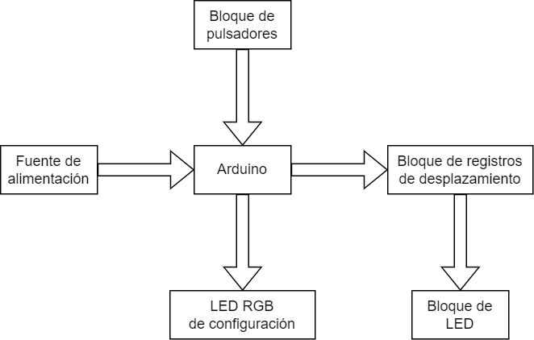
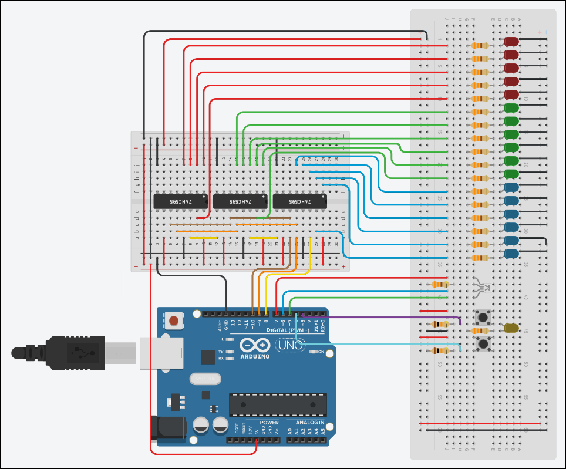

## Reloj con numeración binaria

Proyecto de Arduino elaborado para la asignatura Técnicas Digitales, del Instituto Nacional Superior del Profesorado Técnico - Universidad Tecnológica Nacional.

El mismo se encuentra alojado en Tinkercad:  
https://www.tinkercad.com/things/kf2tOGETS7Z-reloj-con-numeracion-binaria?sharecode=pm1qLd24rhMyvz1zKC8jgqTnQUJaTAxAkxLh6ElukS8  

Video demostración: https://www.youtube.com/watch?v=pmoV_BkbJp8  
  
# 1. Introducción
En este proyecto se construyó un reloj con numeración binaria, basado en la placa de desarrollo Arduino UNO. El mismo consta de una serie de luces LED, conectados a registros de desplazamiento, que mediante su encendido y apagado expresan la hora en el sistema de numeración binaria.
El reloj empieza a contar desde la hora, minuto y segundo cero. Pero cuenta con dos pulsadores con los que se puede configurar la hora: con uno se selecciona el campo a modificar, y con el otro se suma un uno al campo correspondiente.
La finalidad de este proyecto fue combinar los conceptos de electrónica aprendidos en la cursada con los de informática, en primera instancia para fijarlos, pero también para mostrar cómo la simplicidad del sistema de numeración binario se puede traducir en una representación visual funcional de la hora.

 

# 2. Componentes
Los componentes utilizados para realizar este proyecto son:
- 1 placa Arduino UNO;
- 3 registros de desplazamiento 74HC595;
- 2 pulsadores;
- 17 LED: 5 rojos, 6 verdes y 6 azules; opcionalmente uno amarillo;
- 1 LED RGB;
- 19 resistencias: 2 de 10K ohms, 17 de 330 ohms; opcionalmente una más para el LED amarillo;
- 1 placa de desarrollo experimental o protoboard;
- 1 fuente de alimentación (preferentemente un dispositivo con salida USB);
- cables para conexión.  

 

# 3. Diseño y funcionamiento
Para mostrar la hora, sabiendo que tanto los segundos como los minutos están en el intervalo [0;59], alcanza con utilizar 6 LED para cada uno (60 < 26). En cambio, para contar las horas se necesita cubrir el intervalo [0;23], así que se necesitan 5 LED (24 < 25). Por lo tanto, para poder expresar completamente la hora, fue necesario utilizar 17 LED. Por una cuestión de claridad, se muestran los bits de la hora con color rojo, los minutos con color verde y los segundos con color azul.  
Los LED fueron conectados a las salidas de los registros de desplazamiento. A su vez, los registros fueron conectados en cascada, es decir, la salida de datos serie del primero está conectado a la entrada de datos serie del segundo, y lo mismo entre el segundo y el tercero. Esto es para poder pasar en serie la información que se quiere mostrar, para que cada registro coloque en su salida la información en paralelo. Para lograr esto, fue necesario proveerle a los registros tres señales: un pulso de clock para pasar la información entre cada flipflop (*SHI_C*), otro pulso de clock para poder pasar esa información a la salida de los registros (*LAT_C*) y, en el caso del primer registro, la señal de información en serie (*SER_D*). Estas señales fueron provistas por los terminales 10, 9 y 8 de la placa Arduino, respectivamente.  
Para poder configurar la hora, un pulsador fue conectado al terminal 3, que es uno de los terminales disponibles para adjuntar una interrupción. Adicionalmente, se colocó un LED amarillo, un color distinto a los utilizados para expresar la hora, para poder comprobar que los pulsos lleguen correctamente a dicho terminal. El otro pulsador, que realiza la función de sumar uno al campo correspondiente, fue conectado al terminal 4 por una cuestión de cercanía, pero podría haber sido conectado a cualquier otro terminal disponible.  
Para saber si el reloj se encuentra en modo configuración, se utilizó un LED RGB que fue conectado a los terminales 7, 6 y 5 de la placa Arduino. Este LED se ilumina del mismo color que el campo que está siendo configurado.  
  

# 4. Diagrama de bloques

  

# 5. Circuito

  

# 6. Funciones  
Para poder realizar el proyecto, se implementaron las siguientes funciones:  
- **void imprimirHora ()**: imprime la hora por la salida serial.
- **void milisegundos (uint16_t)**:  recibe como argumento un tiempo expresado en milisegundos, y realiza una demora por esa duración utilizando el método *delayMicroseconds*, ya que esta última se puede usar dentro de una rutina de interrupción, a diferencia de las funciones *delay* y *millis*.
- **void pulso (uint8_t)**: recibe un tiempo expresado en milisegundos para generar un pulso, utilizando la función anterior *milisegundos*.
- **void enviar (uint8_t)**: recibe un byte de información y lo coloca en *SER_D* utilizando un bucle.
- **void contar ()**: incrementa, cuenta y reinicia las variables correspondientes a las horas, minutos y segundos.
- **void actualizarLEDS ()**: utiliza los métodos *enviar* y *pulso* para pasar la información del programa a los LED.
- **void confSum (uint8_t)**: recibe un número que representa el campo a configurar y suma uno al mismo, luego llama a *contar* para validar y a *actualizarLEDS* para reflejar el cambio en los LED del campo correspondiente.
- **void setupLedConf (uint8_t)**: recibe un entero que representa el campo que se va a configurar, y envía al led RGB las señales necesarias para que se ilumine del color correspondiente.
- **void config ()**: se encarga de entrar en modo configuración, y se ata al pin 3 de la placa. Utiliza el valor de la variable *estado* para alternar entre los campos a configurar.